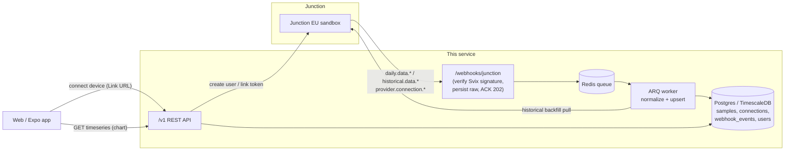

# Backend: Wearables Ingestion & Timeseries API

FastAPI service that connects YOU(th) users to their wearables through [Junction](https://docs.junction.com) and serves their biometrics for timeline charts.

## How it works



**Write path.** Junction delivers webhooks (8 retries, 15s timeout), so the receiver does the bare minimum: verify the Svix signature, persist the raw event (unique `event_id` makes retries no-ops), enqueue, return `202`. The ARQ worker normalizes events into the `samples` table with `INSERT … ON CONFLICT` upserts keyed on `(user_id, metric, ts, provider)`. Every step is idempotent, so at-least-once delivery anywhere in the chain is safe. `historical.data.*` events carry no data; the worker pulls those ranges from Junction's REST API with cursor pagination.

**Read path.** `GET /v1/users/{id}/timeseries/{metric}` buckets server-side (`raw|hour|day|week`) so charts never receive 10k points. Buckets use `date_trunc` today and swap 1:1 for TimescaleDB `time_bucket` + continuous aggregates at scale.

## Layout

```
app/
  api/            HTTP layer: routes, request/response handling only
    v1/           public API (users, devices, timeseries)
    webhooks.py   inbound Junction events
  services/       domain logic: junction client, ingestion normalizers, queries
  workers/        ARQ queue + worker (webhook processing, backfills)
  models.py       SQLAlchemy schema (4 tables)
  schemas.py      Pydantic API contracts
  core/           config, structured logging
  db/             engine/session management
alembic/          migrations
tests/
  unit/           pure logic: normalizers, signature verification
  integration/    real Postgres: webhook → worker → chart API
```

Dependency direction is strictly `api → services → models`; services never import from `api`, and parsing (`ingestion.parse_event`) is pure so the riskiest code (interpreting third-party payloads) is testable without I/O.

## Run it

```bash
# from repo root
cp .env.example .env       # add your Junction sandbox key
docker compose up --build  # api :8000, worker, timescaledb :5432, redis :6379
```

Interactive API docs: http://localhost:8000/docs

### Demo flow (sandbox, no physical device)

```bash
# 1. Create a user (registers with Junction too)
curl -X POST localhost:8000/v1/users -H 'content-type: application/json' \
  -d '{"client_user_id": "demo-user-1"}'

# 2. Attach a demo Oura with 30 days of synthetic data
curl -X POST localhost:8000/v1/users/<id>/devices/demo \
  -H 'content-type: application/json' -d '{"provider": "oura"}'

# 3. Junction starts sending webhooks (needs a public URL, see infra/)
# 4. Chart it
curl 'localhost:8000/v1/users/<id>/timeseries/heartrate?resolution=hour'
```

## Tests

```bash
docker compose up -d db redis    # integration tests use real Postgres (no sqlite)
.venv/bin/python -m pytest tests/ -v
```

- **Unit**: webhook payload normalization (every metric, compound blood-pressure shapes, epoch/ISO timestamps, malformed points, unknown events) and Svix signature verification (valid/tampered/missing).
- **Integration**: endpoint dedupe on retries, idempotent upserts, connection lifecycle, and the full webhook → worker → bucketed-chart path.

## Configuration

All via environment (see `.env.example`). Junction base URL is derived from `JUNCTION_ENVIRONMENT` + `JUNCTION_REGION`: an `sk_eu_*` key means `sandbox` + `eu`.
