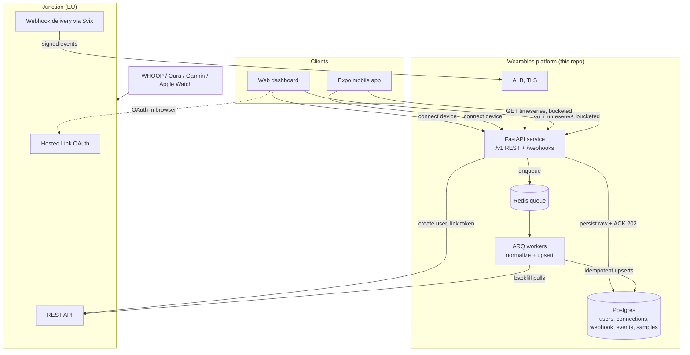
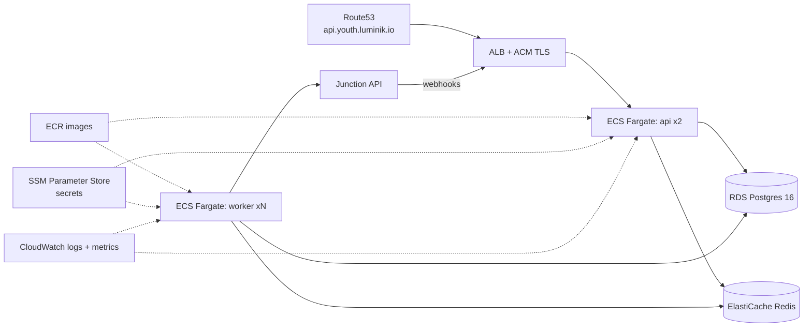
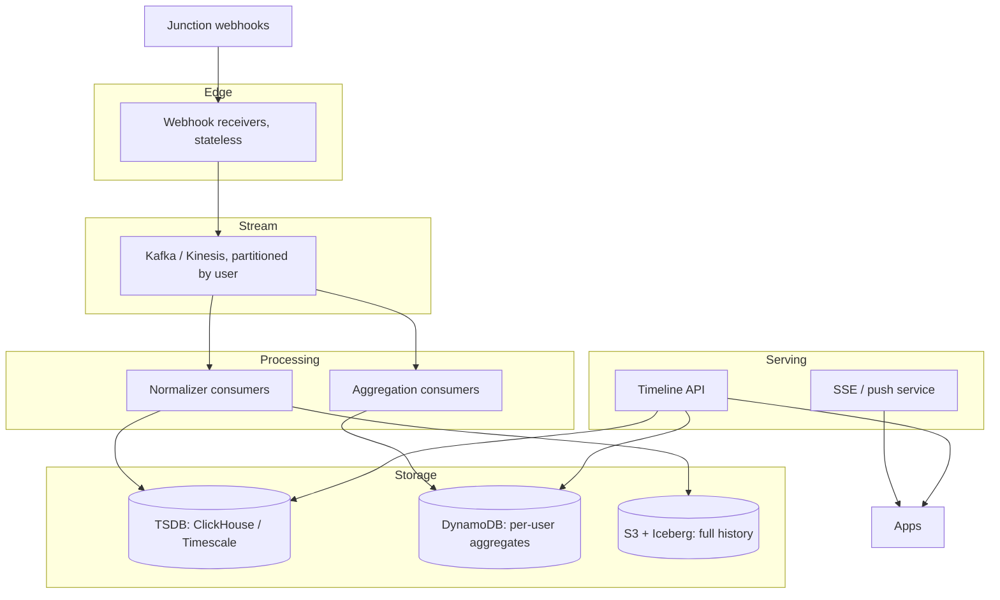

# System Architecture

This document covers three things: the MVP system as built, the deployment on AWS, and
the scaling path from 10k to 50M users.

## 1. MVP system (as built)

### Why this shape

**Webhook receiver does almost nothing.** Junction retries 8 times with a 15 second
timeout and disables endpoints that keep failing. The receiver verifies the Svix
signature, persists the raw event, enqueues, and returns 202 in single-digit
milliseconds. Parsing multi-megabyte heart-rate batches happens in workers.

**Everything is idempotent.** Webhook retries dedupe on the Svix message id (unique
constraint). Sample writes are upserts on the natural key (user, metric, timestamp,
provider). The same event or backfill can be applied any number of times. This makes
at-least-once delivery safe at every step of the chain and allows free replay from the
stored raw events when a normalizer bug needs fixing.

**Queue decouples ingestion from processing.** The challenge states 100 requests per
minute today, growing. Bursts (a provider delivering a day of data for thousands of
users at once) land in Redis and workers drain at their own pace. API latency for app
users is unaffected by ingestion load, and workers scale independently of the API.

**Raw events are the source of truth.** The `webhook_events` table is an audit trail,
a dedupe ledger, and a replay buffer in one. Events that reference unknown users are
parked as failed instead of dropped.

### Data model

| Table | Role | Growth |
|---|---|---|
| `users` | App user, mapped 1:1 to a Junction user | 1 row per user |
| `connections` | Wearable link per provider, with status and freshness | ~1-3 per user |
| `webhook_events` | Raw inbound events (idempotency, audit, replay) | High; pruned/archived on a schedule |
| `samples` | Normalized biometric time series | Dominant; heart rate alone is 1k-10k samples/user/day |

`samples` uses a composite primary key starting with `user_id`, so all chart reads are
tight index range scans. The schema maps 1:1 onto a TimescaleDB hypertable when volume
demands it (the local stack already runs the TimescaleDB image).

## 2. Deployment (AWS, eu-central-1)

EU region matches Junction EU data residency, which matters for health data under GDPR.

Everything is Terraform (`infra/terraform/`): ECS Fargate services for api and worker,
RDS Postgres, ElastiCache Redis, ALB with ACM certificate, Route53 records, ECR, SSM
SecureString secrets injected into tasks, CloudWatch logs with Container Insights.

Demo-scope tradeoffs, called out in code comments: default VPC instead of a dedicated
one, migrations run on API container start instead of a deploy step, local Terraform
state. Each has a documented production replacement.

## 3. Scaling path

The load profile is write-heavy and bursty on ingestion, read-light per user on
serving. Sizing assumes roughly 5k biometric samples/user/day from wearables and a few
chart queries per app session.

### 10k users (now)

What is deployed handles this. ~50M samples/day peaks well within a single Postgres
writer using batched upserts. Knobs: API task count, worker task count, RDS instance
size. Add ECS autoscaling on CPU (api) and queue depth (worker).

### 50k users

Ingestion writes become the first pressure point.

- **Batch harder**: group sample upserts per event into single multi-row statements
  (already done) and tune worker concurrency.
- **Convert `samples` to TimescaleDB hypertable** (or native Postgres range
  partitioning by time). Continuous aggregates precompute the hour/day/week buckets the
  chart API serves, turning chart reads into tiny aggregate lookups.
- **Webhook event pruning**: archive processed `webhook_events` older than 30 days to
  S3 (Parquet) via a scheduled job.
- RDS: move to a larger instance, add one read replica for chart traffic.

### 1M users

The single-writer ceiling and queue throughput become the constraints.

- **Swap Redis queue for managed Kafka (MSK) or SQS**: durable, partitioned by
  `user_id`, consumer groups per resource type. The persist-then-process design carries
  over unchanged; the webhook receiver becomes a thin producer.
- **Storage split**: keep hot 90 days in Timescale/partitioned Postgres, tier older
  data to S3 + Athena/Iceberg for research and exports. The chart API reads hot
  storage only.
- **Service split** along the existing module boundaries: ingestion service (webhook +
  workers) and serving service (timeline API) deploy and scale independently. The
  repo's `api / services / workers` layering is exactly this seam.
- Multi-AZ RDS, read replicas per serving region, PgBouncer/RDS Proxy for connection
  pooling.
- SSE fan-out for live updates moves to a dedicated push service backed by Redis
  pub/sub or API Gateway WebSockets.

### 50M users

At ~250B samples/day, this is a purpose-built time-series platform.

- **Ingestion**: Kinesis/Kafka as the front door with schema-registry governed events.
  Webhook receivers are stateless producers behind regional ALBs.
- **Storage**: dedicated TSDB layer. Options: ClickHouse (analytical queries over
  biometrics), Timescale multi-node, or DynamoDB for per-user recent windows plus
  columnar S3 (Iceberg) for history. Choice driven by the product's analytical needs.
- **Serving**: precomputed per-user daily aggregates in a key-value store (DynamoDB)
  for instant timeline loads; raw drill-down hits the TSDB.
- **Multi-region**: EU and US cells matching Junction's regions and data-residency
  requirements; users pinned to a home region (cell-based architecture).
- **Org**: each cell is operationally identical, deployed from the same Terraform with
  different variables.

### What stays constant at every tier

1. Verify signature, persist raw, ACK fast, process async.
2. Idempotent writes on natural keys.
3. Server-side bucketing; clients never receive raw firehoses.
4. Provider-agnostic normalized sample model; adding wearable N+1 is a parser, never a
   schema change.

## 4. Operational concerns

- **Sync-issue detection**: `connections.last_data_at` is updated on every ingested
  sample. A scheduled check flags connections silent for 24h+, driving the in-app
  "sync issues" banner and a `provider.connection.error` style alert.
- **Observability**: structured JSON logs (request id, user id, event type) to
  CloudWatch; Container Insights metrics; the queue depth and webhook failure rate are
  the two alerts that matter first.
- **Security**: Svix signature verification on every webhook, secrets in SSM
  SecureString, least-privilege IAM, TLS end to end, no PHI in logs.
- **GDPR**: EU region pinning, user deletion cascades (FK `ON DELETE CASCADE` plus
  Junction-side deregistration), raw event archives with TTL.
