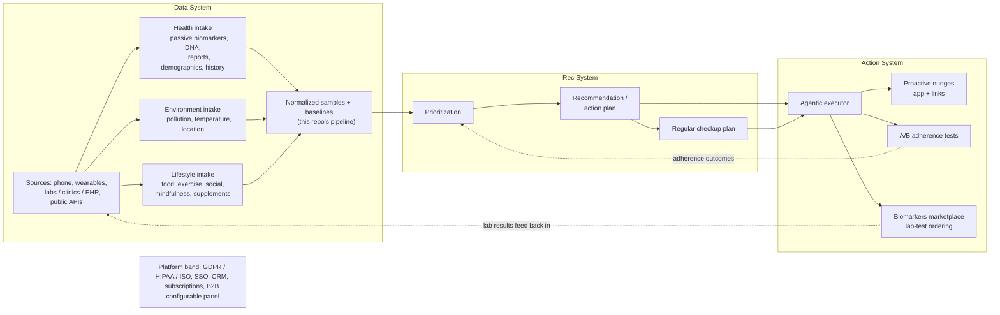
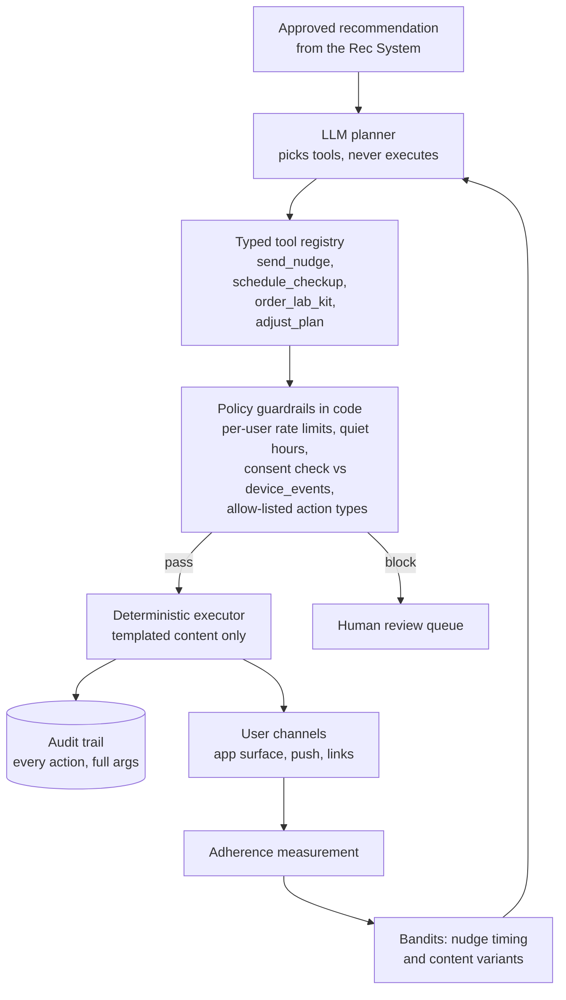

# Recommendation system: from passive biomarkers to a closed loop

The platform in this repo is the passive-biomarkers pillar of the Data System on the
whiteboard: wearables stream in through signed webhooks, land as raw events, normalize
into one provider-agnostic sample model, and surface as personal-baseline insights
(docs/architecture.md, docs/insights.md). This document extends that foundation to the
full loop the founders sketched: a Data System that ingests health, environment, and
lifestyle signals with zero friction; a Rec System that turns them into prioritized,
explainable action plans; and an Action System that executes those plans, measures
adherence, and feeds lab results back into the data. It also answers the two direct
questions from the session: when to hire the first data scientist, and how the design
absorbs sudden bursts of device syncs.

## The whiteboard as one loop

The dotted arrows are the two loops that make this a system rather than a pipeline:
adherence outcomes reshape prioritization, and marketplace lab results re-enter the
Data System as first-class samples. The founders' `health = f(biomarkers, DNA,
lifestyle, ...)` is exactly what the normalized sample model already encodes: every
input, whatever its source, becomes a typed, timestamped, per-user observation that a
function can consume.

## 1. Data System: the existing platform, generalized

The hard problems of the Data System are already solved in this repo for the hardest
source class (high-volume, bursty, multi-shaped wearable streams). The invariants that
hold at every scaling tier in docs/architecture.md are precisely the ones the other
intake pillars need:

1. Verify, persist raw, ACK fast, process async.
2. Idempotent writes on natural keys, so any source can be replayed safely.
3. Provider-agnostic normalized samples; adding source N+1 is a parser, never a
   schema change.
4. A consent and lifecycle ledger (`device_events`) with actor attribution, and
   erasure that cascades locally and upstream.

The architecture doc calls out the seam that matters most: one resource fans out to
many metrics. A nightly sleep summary becomes heart rate, HRV, and breathing rate
samples; the parser treats the inbound shape as an input format, never as the metric
itself. New intake pillars are new parsers behind that same seam:

- **Labs / clinics / EHR**: a FHIR adapter mapping `Observation` resources (LOINC
  coded) onto samples. A lab panel is one resource fanning out to N biomarkers, which
  is structurally identical to a sleep summary fanning out to three metrics. Document
  references (DNA reports, microbiome panels) persist raw with extracted structured
  values alongside, the same raw-plus-normalized pattern as `webhook_events`.
- **Questionnaires and manual logging**: lifestyle entries (food, exercise, social,
  mindfulness, supplements) post through the existing authenticated API as samples
  with a `self_report` provider. Zero-friction stays the goal, so phone-side passive
  capture (HealthKit workouts, screen-time, location dwell) fills most of this pillar
  without asking the user anything.
- **Environment APIs**: pollution, temperature, pollen, daylight keyed on coarse
  location. These are fetched, never pushed: a scheduled worker resolves each user's
  current location cell and upserts environment samples on (user, metric, ts,
  source). Coarse cells keep precise location out of the store.

Identity and consent are per source. Every connection, of a wearable today or a lab
provider tomorrow, writes the consent ledger on connect and disconnect, and every
sample carries its provider, so erasure and per-source revocation stay one query. The
dual-environment pattern (each user carries their upstream environment, secrets
resolve per environment) generalizes to per-source credentials without new
architecture.

## 2. Rec System: layers that earn their complexity

`health = f(biomarkers, DNA, lifestyle, ...)` is the right ambition and the wrong
first implementation target. Nobody can learn that function on day one because there
is no outcome data yet. The system that ships first must be useful, safe, and
auditable with the data that exists, and structured so each later layer slots in
without rework.

### Layer 1, ship first: deterministic rules over personal baselines

The personal-baseline math already exists and is already shared across clients
(docs/insights.md): typical ranges from each person's own history, deviation
sentences, week-over-week deltas, clinical reference bands where one is broadly
accepted. Layer 1 is a rules engine over those primitives plus published clinical
guidelines: sleep regularity, activity minutes, recovery trends, hydration around heat
days from the environment pillar.

A rule is data, versioned in the repo: condition over normalized samples and
baselines, recommendation template, evidence citation, priority weight. Prioritization
is a transparent scoring pass over fired rules. Every output is explainable in one
sentence ("your resting heart rate has been above your typical range for 6 of the
last 7 days, and sleep duration is trending down") and auditable by a clinician
reading the rule file. No model risk, no inference cost, no hallucination surface.
This layer alone is a sellable product.

### Layer 2: LLM as composer and explainer, never as oracle

The LLM's job is composition over structured inputs: fired rules, baseline states,
trends, the user's stated goals, and retrieved passages from a curated clinical
knowledge base (guideline summaries we wrote and reviewed, never the open web). It
turns ten fired rules into one coherent weekly plan, sequences actions sensibly,
explains in plain language, and drafts the regular checkup plan.

Hard boundaries, enforced in code rather than in the prompt:

- **Structured output only.** The model returns typed recommendation objects against
  a schema; free-form medical claims have no path to the user.
- **Evidence and confidence are mandatory fields.** Every recommendation carries the
  rules and sources it composed from and a confidence score; missing either is a
  validation failure, never a soft warning.
- **Novelty gates to humans.** Anything outside the catalog of approved
  recommendation types lands in a human-review queue instead of shipping.
- **The non-diagnostic boundary this repo already enforces stays the product
  voice.** Recommendations describe data relative to the person's own history and
  suggest lifestyle-level actions; anything that smells clinical becomes "worth
  discussing with a professional", with the checkup plan and the lab marketplace as
  the structured path to do so.

### Layer 3: learned models, once there is something to learn from

This layer earns its way in with data volume:

- **Learned ranking** of recommendations per user, replacing hand-tuned priority
  weights once adherence data shows which recommendations each cohort actually acts
  on.
- **Bandits on nudge timing and content**, fed by the adherence A/B tests the
  founders already drew on the board. Bandits beat fixed A/B splits here because the
  action space (send hour, channel, phrasing variant) is large and per-user.
- **Outcome models** once the lab-test feedback loop closes: recommendation, then
  adherence, then a follow-up panel from the marketplace, is a labeled training pair.
  This is where `f(biomarkers, DNA, lifestyle, ...)` starts being learned rather
  than asserted.

### The hiring answer

Start with strong engineering plus rules and LLMs. Layers 1 and 2 need engineers, a
clinical advisor reviewing the rulebook and knowledge base, and evaluation
discipline. They never need a research team. Hiring a data scientist on day one gives
them no data to work with and the wrong problems: they would spend their first year
building the ingestion, normalization, and evaluation plumbing that platform
engineers build better.

Hire the first data scientist when Layer 3 has data to learn from. Concrete triggers,
checked quarterly:

| Trigger | Threshold (order of magnitude) |
|---|---|
| Adherence-outcome pairs | ~1,000 users with 8+ weeks of recommendation, adherence, and follow-up signal |
| Bandit complexity | Nudge optimization decisions visibly outgrowing heuristics (flat or declining adherence despite variant testing) |
| Closed lab loop | Marketplace results flowing back at volume, making outcome modeling possible |
| Regulatory validation | Any move toward claims that require statistical validation of effect |

Until then, every data-science-shaped task (baselines, deltas, scoring) is pure
functions in `packages/health-core`, exactly where the insight math lives today.

### Evaluation before intelligence

The evaluation harness ships before Layer 2 does, because an unevaluated LLM layer is
a liability wearing a feature's clothes:

- **Golden sets**: curated user states with expert-agreed correct recommendations;
  every prompt or model change replays against them.
- **Clinician spot-review**: a sampled queue of live outputs reviewed weekly; review
  rate scales down as confidence calibrates, never to zero.
- **Offline replay**: the raw-event store already makes the whole pipeline
  replayable; candidate rule and model changes run against historical data before
  they touch a user.
- **Guardrail tests**: adversarial inputs (alarming readings, medication questions,
  self-harm signals) with required-behavior assertions: defer, refer, never
  diagnose. These run in CI like any other test.

## 3. Action System: the LLM plans, deterministic code executes

The planner is an LLM choosing from a typed tool registry: send a nudge, schedule a
checkup, order a lab kit through the biomarkers marketplace, adjust the active plan.
Every tool call passes through policy guardrails that live in code, never in a
prompt: per-user rate limits, quiet hours, a consent check against the same
`device_events` ledger pattern the platform uses today, and an allow-list of action
types. Anything the guardrails block routes to the human review queue rather than
silently dropping.

The executor is deterministic and the agent never free-texts a user: every nudge and
plan update renders from a reviewed template with typed slots. The audit trail
records every executed action with full arguments, giving the same replay and
accountability properties the raw webhook store gives ingestion. Adherence
measurement (did the user open it, act on it, log the follow-through) feeds the
bandits, which close the loop back into planning. Ordering a lab kit is just another
tool call, and its results arrive through the Data System's lab adapter, which is the
whiteboard's feedback arrow made concrete.

## 4. Burst handling

This was a direct question, and it is the part the repo already answers in
production. The design absorbs bursts by construction:

- The webhook receiver verifies the signature, persists the raw event, enqueues, and
  ACKs 202 in single-digit milliseconds, well inside the sender's 15 second timeout
  and 8-retry budget. Heavy parsing never happens in the request path.
- Bursts land in the queue and workers drain at their own pace. The canonical case
  from docs/architecture.md: a provider delivering a full day of data for thousands
  of users at once parks in Redis while API latency for app users stays flat.
- Everything downstream is idempotent: events dedupe on the message id, samples
  upsert on (user, metric, ts, provider). A retry storm is a no-op, never a
  corruption. At ~5k samples/user/day, the current single-writer Postgres with
  batched upserts handles the 10k-user tier (~50M samples/day) with headroom.

The growth path, in order of need:

- **Worker autoscaling on queue depth**, the first knob, already identified in the
  architecture doc.
- **Per-provider and per-user rate shaping** in the workers, so one provider's
  backfill burst cannot starve everyone else's freshness.
- **Kafka or SQS as the front door at the 1M tier**, partitioned by user id; the
  persist-then-process design carries over unchanged and the receiver becomes a thin
  producer.
- **Backpressure and DLQ**: events that exhaust retries park as failed (the pattern
  already exists for unknown-user events) and replay from raw once the cause is
  fixed.

The one-line answer: bursts are a queue-depth graph, never an incident, because
nothing user-facing waits on ingestion and every write can be retried blindly.

## 5. Platform band

**GDPR / HIPAA / ISO.** The repo already runs EU-pinned with cascade erasure, a
consent ledger, raw-event retention sweeps, secrets in SSM, and no PHI in logs
(docs/architecture.md, docs/authentication.md). HIPAA readiness for US clinic
partners adds a BAA-capable hosting profile and access logging; ISO 27001 is mostly
evidence collection over controls this codebase already practices.

**SSO.** Clerk handles consumer auth today; B2B SSO (SAML / OIDC per clinic) is a
Clerk enterprise-connection configuration plus the per-tenant scoping the white-label
config service introduces, building on the production hardening queue in
docs/authentication.md (per-consumer credentials, rate limits, audit logging).

**CRM.** The Action System's audit trail is the CRM feed: every nudge, checkup, and
order is a typed event, so syncing to a CRM is an outbound consumer on the same
queue, never a parallel data path.

**Subscriptions.** Entitlements live in the tenant and user config the white-label
strategy already defines; the metric capability map in `packages/health-core` is the
natural place gating decisions get enforced once per contract type.

**B2B configurable panel and dashboard.** This is docs/white-label-strategy.md
directly: onboarding a clinic is a config row, themes and enabled features are data,
and the partner dashboard is the existing web app reading the same tenant config with
an admin scope. Tier 1 multi-tenant covers the panel on day one; Tiers 2 and 3 cover
brand-sensitive distribution.

## 6. Staged roadmap

| Stage | Ships | Notes |
|---|---|---|
| Weeks 1-4 | Layer 1 rules engine over existing baselines; recommendation catalog v1; FHIR lab adapter skeleton; evaluation harness (golden sets, guardrail tests in CI) | Useful product on existing data; zero model risk |
| Months 2-3 | Layer 2 LLM composer with structured output, evidence, confidence; curated knowledge base; human-review queue; Action System v1 (planner, tool registry, guardrails, templated nudges, audit trail) | Clinical advisor reviewing rulebook and outputs |
| Months 4-6 | Adherence measurement and A/B variants; environment and questionnaire pillars live; marketplace lab loop closing; bandit infrastructure on nudge timing | Adherence-outcome pairs start accumulating |
| Trigger point | **First data scientist hire** when ~1,000 users have 8+ weeks of adherence and outcome pairs, or bandits outgrow heuristics, or validation needs demand it | Layer 3: learned ranking, outcome models |

Each stage runs on the platform this repo already deploys: same ingestion path, same
queue, same idempotent writes, same consent ledger. The recommendation loop is new
consumers of that data, never a new platform.
