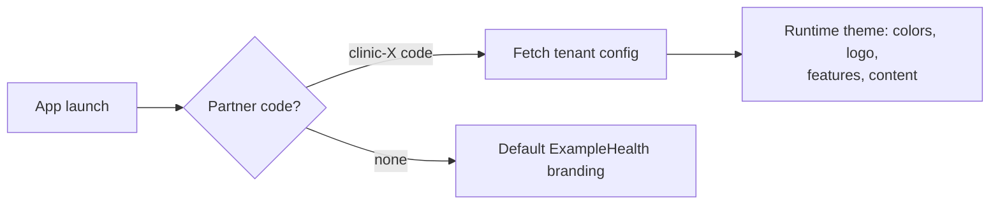

# White-labeling the ExampleHealth app for clinic partners

**Problem.** Clinics want the app under their own brand. On iOS this collides with two
platform constraints:

1. **OTA updates can't change native identity.** Expo EAS Update (or any CodePush-style
   mechanism) can swap anything in the JS bundle — themes, logos inside the app, copy,
   features — but never the home-screen **app name, icon, or bundle ID**. Apple guideline
   3.3.2 also prohibits changing the app's character via OTA.
2. **One account can't publish N skinned clones.** App Review Guideline 4.2.6 (and the 4.3
   spam rule) requires template-derived apps to be submitted by the *client's own*
   developer account — enrolling each clinic takes weeks (D-U-N-S, agreements, review).

Neither constraint blocks white-labeling; they dictate *distribution tiers*. One Expo
codebase powers all three.

---

## Tier 1 — Multi-tenant single app (default for every clinic)

One public "ExampleHealth Health Hub" app. The clinic partner code (already in the product —
the "coming from a partner?" + code flow) selects a **tenant configuration served by the
backend**: colors, logos, content blocks, enabled features, support links.

- **Onboarding a clinic = a config row**, not a release. Instant, no Apple involvement.
- Theme changes are *data*, not code — not even an OTA update is needed; EAS Update
  covers actual UI/flow changes for all tenants at once.
- iOS **alternate app icons** soften the icon limitation: ship clinic icons in the binary
  and let the app switch after tenant login (an App Store release per icon batch, but no
  separate app).
- Concession: the App Store listing and home-screen *name* stay ExampleHealth.

**Use when:** clinic accepts co-branding inside the app. This should be the contractual
default — 95% of the value at ~0% of the distribution cost.

## Tier 2 — Apple Business Manager "Custom Apps" ⭐ recommended for brand-sensitive clinics

Apple's sanctioned channel for exactly this B2B case. ExampleHealth publishes a
clinic-branded variant (own name, icon, bundle ID) as a **private custom app under
ExampleHealth's own developer account**, visible only to that clinic's organization via Apple
Business Manager — 4.2.6 does not apply because the app never enters the public store.

- Clinic needs only a **free ABM enrollment** (days, not weeks; no developer account).
  Distribution to staff/patients via redemption links or the clinic's MDM.
- In Expo this is mechanical: `app.config.ts` reads a tenant profile (name, icon,
  bundleIdentifier) → `eas build --profile clinic-x` → `eas submit`. Each variant rides
  the same **EAS Update channel pipeline**, so fixes still ship OTA to every variant.
- Review: custom apps go through standard App Review under ExampleHealth's account — days,
  predictable, parallelizable.

**Use when:** the clinic's brand must be on the icon/name. This is the clinic-friendly
sweet spot: full branding, no clinic-side Apple bureaucracy, release pipeline stays
entirely in ExampleHealth's hands.

## Tier 3 — Public App Store app under the clinic's account (flagship partners only)

Unavoidable per 4.2.6 when a clinic demands *public* App Store presence under their own
name. Make it cheap:

- Same per-tenant Expo build profile as Tier 2; submission targets the clinic's App
  Store Connect via an API key they grant.
- **Start the clinic's Apple Developer enrollment at contract signature** so Apple's
  weeks run during onboarding, not after it.
- Contractually scope it (e.g. enterprise tier only) — each Tier 3 app adds a real
  ongoing release-coordination cost.

## Android (for completeness)

None of these restrictions exist. Managed Google Play distributes private clinic apps
trivially; one account can publish multiple branded apps. Android should always be the
fast path while an iOS Tier 2/3 variant is in flight.

## Summary

| | Branding depth | Clinic effort | Time to launch | Apple risk |
|---|---|---|---|---|
| **Tier 1** multi-tenant | In-app only (name/icon stay ExampleHealth) | None | Hours | None |
| **Tier 2** ABM custom app ⭐ | Full (name, icon, private listing) | Free ABM signup | ~1–2 weeks | Low |
| **Tier 3** clinic-account public app | Full + public store presence | Dev account ($99/yr, weeks) | 4–8 weeks | Guideline 4.2.6 applies |

**Recommendation:** contract Tier 1 as the default, offer Tier 2 as the premium
"your brand" option, reserve Tier 3 for flagship partnerships. All three are one
codebase with per-tenant config — the engineering investment is the tenant-config
service and the EAS build matrix, both small.
